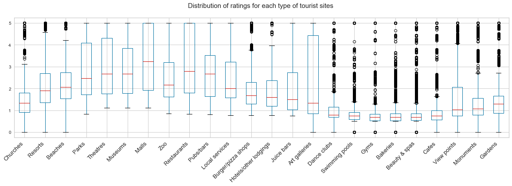
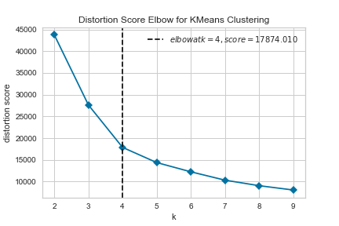
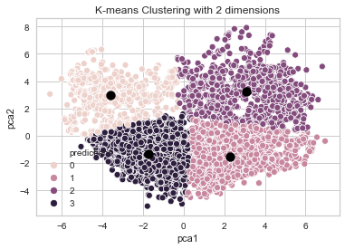
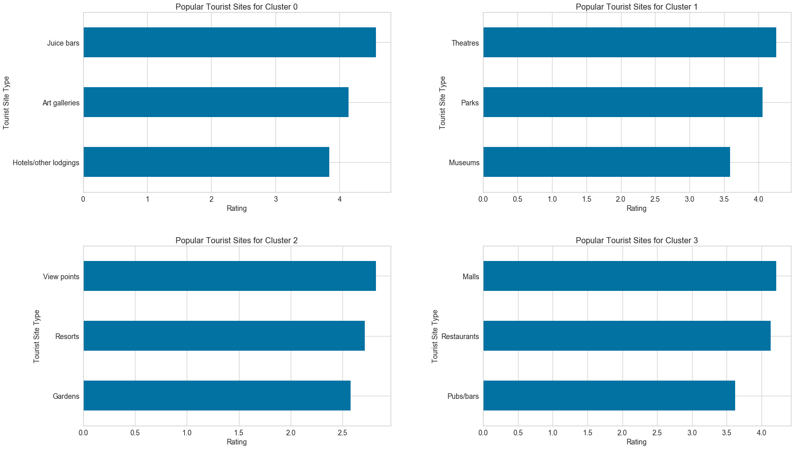
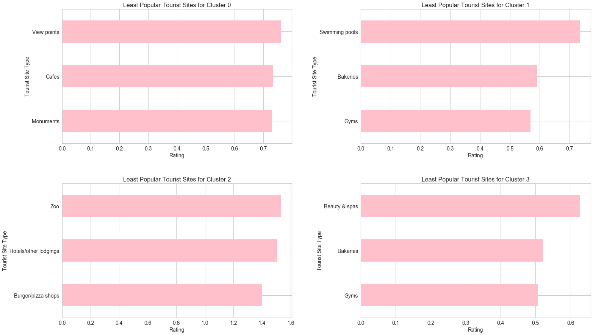
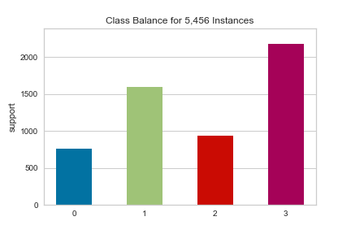
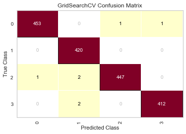

# Europe Travel Reviews

by Sharon Kwak

- Which type of tourist sites are the most popular? Overall? For each group of users?
- What groups can be created based on users' reviews of tourist sites?
- Which tourist attractions in other areas can be recommended to these users based on their ratings?
- What type of travel media content should be created for each group of users (e.g. advertisement, leisure/entertainment)?
- Can a review of one type predict the user's review for another type?
- Ratings for which type of tourist sites have the most impact on the group assignments?

## Dataset
[UCI Europe Travel Review Ratings](https://archive.ics.uci.edu/ml/datasets/Tarvel+Review+Ratings)

The dataset has review ratings from 5456 users for 24 different tourist site types in Europe. The ratings are from 0 to 5. It includes the user id and the average ratings for the following tourist site types:

|Features||||||||
|--------|--|--|--|--|--|--|--|
|churches|resorts|beaches|parks|theatres|museums|malls|zoo|
|restaurants|pubs/bars|local services|burger/pizza shops|hotels/other lodgings|juice bars|art galleries|dance clubs|
|swimming pools|gyms|bakeries|beauty & spas|cafes|viewpoints|monuments|gardens|

**General overview of the ratings for each type of tourist site type**

Simply based on the above boxplot and observing the quartiles (25%, 50%, and 75%), gyms, bakeries, and beauty & spas had more lower ratings while restaurants and malls had more higher ratings.

## Clustering
With no specified ('labeled') target variable (dependent variable), unsupervised learning will be used with clustering. I chose the K-means clustering algorithm to find center-based clusters, finding a 'consensus' for the whole dataset, which other methods do not do. I was able to use an algorithm that considers the full dataset without worrying about computation efficiency due to the dataset being small with 5456 rows and 25 features.

First, I used the 'Elbow' method to find the best k-value for this data.

According to the elbow visualizer above, 4 was the most optimal. Using 4 as the k-value, I ran K-means and fit it to the dataset to get the following clusters (0-3):

Based on the clusters, I found the average ratings for each tourist site type and explored the most and least popular sites for each cluster.

<b>Most popular sites</b>

<b>Least popular sites</b>

### Summary
**Group 0**:
- fewest values
- highest average ratings for juice bars (4.6), art galleries (4.2), and hotels/other lodgings (3.8)
- lowest average rating for monuments (0.731), cafes (0.733), and viewpoints (0.76)

**Group 1**:
- theatres had highest average ratings for theatres (4.3), with parks (4.1) and museums following (3.6)
- gyms had lowest average rating (0.57), with bakeries (0.59) and pools (0.7) following

**Group 2**:
- viewpoints had highest average rating (2.8), with resorts (2.7) and gardens (2.6) following
- burger/pizza shops had lowest average rating (1.4), with hotels/other lodgings (1.5 and zoos following

**Group 3**:
- most values
- highest average rating for malls (4.2), restaurants, and pubs/bars
- lowest average rating for gyms (0.5), bakeries, and beauty/spas

## Classification
Using the clusters from above as the classes, I trained a classification model to predict which users will be assigned to which cluster.

Due to the class imbalance, I used the SMOTE Oversampling method to balance the classes. With the balanced classes, I started with the Linear Support Vector Classifier (Linear SVC) algorithm. I decided to start out with Linear SVC due to it being known to work well on small number of examples and known for fast training times. It also works well with continuous features, and all of the features of this dataset are continuous.

### Results
Linear SVC came out to be the best performing model with an f1-score of 99.6%. As you can see below in the confusion matrix, only 7 values were misidentified while the others were all correctly identified.

Through observing the coefficients from the SVC model, juice bars, theatres, and art galleries had the highest absolute coefficients and thus more impact on identifying the groups. Juice bars and art galleries had a positive impact (the higher the ratings, the higher the cluster group number). Theatres, on the other hand, had a negative impact (the lower the ratings, the higher the cluster group number).

**Note**: In case the SVC model did not perform well, I would have used KNN, LightGBM, and Random Forest for a better model. I used these other models, with the exception of Random Forest, for this project as well to double check that there aren't huge discrepancies in the model performances.

## Next Steps
With more time, I would have done a correlation exploration for each of the clusters, analyzing the relationships between different pairs of tourist site types to see if the tourist site types have linear relationships in any or all of the clusters. 

With more resources, I would first like to collect data from more users and from more travel sites to have a more accurate model since this particular dataset was small and was only from one website. I would also like to collect written reviews that go along with the numerical ratings or categorized ratings (e.g. convenience, cleanliness, engaging, location, etc.), if available, to conduct a textual analysis and/or a deeper study of their ratings and better understand what they liked and disliked for each type, their interests, etc.

It would also be interesting to see relationships of users' demographics and their ratings (e.g. Do women enjoy a certain type of tourist sites more than men? Does a particular race/ethnicity give a specific tourist site type higher ratings than others?)

I would also like to compare their travel interests with their entertainment interests, collecting data of these users' ratings of entertainment and media content to explore whether a users' travel ratings can help predict their interest in particular entertainment and media content.